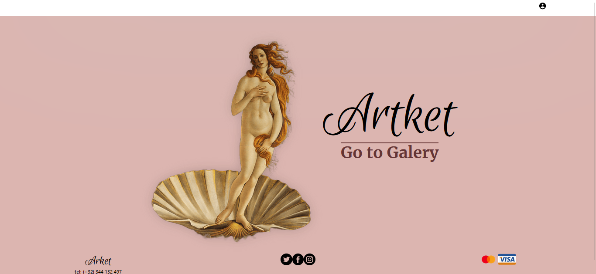

## Artket

 </img>

## Introduction

This repository is the frontend of a project that I did with my partners. This project is a website where we sell artwork.
Im decided to separate the repositorie of the project in the folder of backend and the frontend because its easier for the deveployment.
For the deployment of this folder, I used a site called Vercel.
You can visit the repository of the backend in my profile if you wish.

## BoilerPlate

This repository is the backend of a project that I did with my partners. This project is a website where we sell artwork. On this site, the client can find artwork and buy it and other functions like registering, logging and filtering the work of art.
Im decided to separate the repositorie of the project in the folder of backend and the frontend because its easier for the deveployment.
For the deployment of the backend, I used a site called Heroku.
The information about the project like functionalities, photos and objetives are in the repository called PF-Deploy-back.
You can visit the repository of the frontend in my profile if you wish.


El boilerplate cuenta con dos carpetas: `api` y `client`. En estas carpetas estará el código del back-end y el front-end respectivamente.

En api crear un archivo llamado: .env que tenga la siguiente forma:

```
DB_USER=usuariodepostgres
DB_PASSWORD=passwordDePostgres
DB_HOST=localhost
```

Reemplazar `usuariodepostgres` y `passwordDePostgres` con tus propias credenciales para conectarte a postgres. Este archivo va ser ignorado en la subida a github, ya que contiene información sensible (las credenciales).